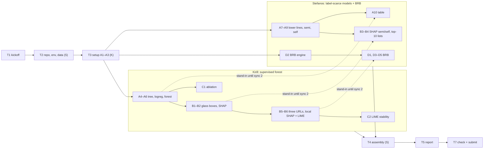

# Lab 4.1 Task List: Explaining Phishing Detectors

- **Course:** AI for Cybersecurity (D7084E / D7041E), Group 6
- **Kirill Silchenko (K):** kirsil-5@student.ltu.se
- **Stefanos Ntentopoulos (S):** stente-5@student.ltu.se
- **Deadline:** ____________ (copy it from Canvas)
- **Random seed:** `random_state=42` everywhere (the lab requires it)

This file turns the Lab 4.1 instructions (`4.1 Lab_ Explaining_Phishing_Detectors.pdf`) into tasks. The
**task overview** right below lists every task without owners. **Division of work** then assigns the
tasks to us, and section 3 explains each one: why it exists, what to do, and when it is done.

Task IDs: **T1–T7** are setup and hand-in tasks. The lab's own steps keep the lab's names (**A1–A10,
B1–B6, C1–C2, D1–D5**), so every task can be matched to the PDF directly. **X1–X5** are optional extras.

> Copy example code from the **PDF**, not from the `.txt` file. The text extraction duplicated some
> lines (the `print` line in A7, `return fb, fg` in D2, `return np.array(out)` in D4 and the whole SHAP
> block in D5).

---

## Task overview (no owners)

Every task in the order the lab does it. "Needs" lists what must be finished first. Replace ☐ with ☑
when a task is done.

### Setup

| ID | Task | What it is and why | Needs | Done |
|---|---|---|---|---|
| T1 | Kickoff: agree on the plan | Fix the working method (section 2): part notebooks, step markers, variable names and file owners. After this hour, both of us can work alone | – | ☐ |
| T2 | Repository, environment and dataset | Folder layout, pinned `requirements.txt`, `.gitignore`, and `dataset_phishing.csv` in `data/`, so the code runs the same way on both machines | T1 | ☐ |
| T3 | Setup notebook (lab steps A1–A3) | Install cell, load the data, label and 60/20/20 stratified split, and the `report()` helper. Every other notebook starts from this one | T2 | ☐ |
| T4 | Assembly script | `tools/assemble.py` merges our part notebooks into the **one** notebook the lab asks for, in lab order, without the stand-in cells | T1 | ☑ |

### Part A: train the detectors

| ID | Task | What it is and why | Needs | Done |
|---|---|---|---|---|
| A1–A3 | Load the data, split it, `report()` helper | Done in **T3** (setup notebook), because every other notebook starts from these steps | T2 | see T3 |
| A4 | Glass box 1: small decision tree | Depth 3 and 4, keep the better one on **validation**. It is the readable model we read in B1 | T3 | ☑ |
| A5 | Glass box 2: logistic regression | Scaled inside a Pipeline, one weight per feature. The second readable model | T3 | ☑ |
| A6 | Black box: Random Forest, 100% labels | 300 trees. The **upper line**: the best score to expect when every URL has a label | T3 | ☑ |
| A7 | Hide 95% of the labels and train the lower lines | 5% labelled split made from the **training set only**; forest and logreg on the 5% alone. Without these baselines we cannot tell whether unlabelled data helped | T3 | ☑ |
| A8 | Semi-supervised: pseudo-labelling | Three rounds at CUTOFF 0.9. Use `y_hidden` **only** to check how accurate the guesses were | A7 | ☑ |
| A9 | Self-supervised: fill-in-the-blanks network | Hide 20% of the scaled values, learn 32 hidden numbers per URL without labels, then logistic regression on the 5% labels | A7 | ☑ |
| A10 | All seven detectors on the same test set | The main results table of the report, and the answer to "did the unlabelled data help?" | A4–A9 | ☑ |

### Part B: explain the detectors

| ID | Task | What it is and why | Needs | Done |
|---|---|---|---|---|
| B1 | Read the glass boxes | Print the tree as rules and the 10 strongest logistic-regression weights; write the tree's first question in plain English | A4, A5 | ☑ |
| B2 | SHAP for the supervised forest (global) | Bar and beeswarm plots and the top-10 list (`shap_top`). The ranking is also the input for the BRB in D1 | A6 | ☑ |
| B3 | SHAP for the semi- and self-supervised models | TreeExplainer for the semi-supervised forest, the general `shap.Explainer` for the self-supervised model | A8, A9 | ☑ |
| B4 | Do the models look at the same clues? | One table with the top-10 features of tree, logreg and the three SHAP rankings | B1–B3 | ☑ |
| B5 | Pick three URLs to explain | The forest's surest phishing URL, surest legitimate URL and most confident mistake (`i_wrong`, reused in D5) | A6 | ☑ |
| B6 | Local explanations with SHAP and LIME | Waterfall plots and LIME charts, with fit scores, for the three URLs | B2, B5 | ☑ |

### Part C: test the detector and the explanation

| ID | Task | What it is and why | Needs | Done |
|---|---|---|---|---|
| C1 | Ablation: remove the 7 external features | Retrain the forest without live lookups: how much does it depend on them, and what does it look at instead? | A6 | ☑ |
| C2 | Stability of LIME | LIME 5 times with 5 seeds on the same URL: how often is the top 3 the same? SHAP gives 5 of 5 | B5, B6 | ☑ |

### Part D: from explanations to rules (BRB)

| ID | Task | What it is and why | Needs | Done |
|---|---|---|---|---|
| D1 | Choose the two antecedent features | Top two of the SHAP ranking with more than 2 distinct values, or a hand-picked pair with a reason | B2 | ☑ |
| D2 | BRB engine | Input transformation, activation weights and Evidential Reasoning with an Unknown part | T3 | ☑ |
| D3 | Referential values and the 9 rules | Low/Medium/High from training percentiles; each rule's beliefs from its share of phishing URLs; the hand-edit experiment | D1, D2 | ☑ |
| D4 | BRB as a phishing detector | Utility gives one phishing score; compared with a tree and a forest that see the same two features | D3 | ☑ |
| D5 | Explain one URL with the rules, LIME and SHAP | Which rules fire for the forest's mistake, how much is Unknown, and do LIME and SHAP agree with the rules? | D4, B5 | ☑ |

### Optional extras

| ID | Task | What it is and why | Needs | Done |
|---|---|---|---|---|
| X1 | CUTOFF sweep 0.85 / 0.90 / 0.95 | The lab invites it. Shows how the number and quality of pseudo-labels trade off | A8 | ☐ |
| X2 | LIME stability on all three URLs, and SHAP run twice | Makes the C2 claim ("LIME unstable, SHAP stable") rest on more than one URL | C2 | ☐ |
| X3 | Second BRB on a hand-picked pair (e.g. `page_rank` + `nb_hyperlinks`) | D1 allows it. Is a feature pair that a security person would choose better or worse than the SHAP pair? | D4 | ☐ |
| X4 | Feature choice checked on validation data | D1 ranks features on test rows. Showing that validation rows give the same pair removes any test-leakage doubt | D1 | ☐ |
| X5 | Cross-check the ER code with our Lab 3 `brbes.py` | Two independent implementations that agree give confidence in D2 | D3 | ☐ |

### Report and hand-in

| ID | Task | What it is and why | Needs | Done |
|---|---|---|---|---|
| T5 | Report (2–3 pages) | Five headings set by the lab, captioned figures and tables, code screenshot, who-did-what line, AI-use statement | all steps | ☐ |
| T6 | README | Libraries, dataset, how to run (the lab asks for it) | T2, T4 | ☐ |
| T7 | Final check and submission | Fresh clone, run the assembled notebook top to bottom, compare its numbers with the report, upload to Canvas | T5, T6 | ☐ |

---

## Division of work

### Who does what

We split by **track**. Kirill owns everything about the supervised forest: training it and explaining it,
globally and for single URLs, and testing it (ablation, LIME stability). Stefanos owns the
label-scarce models (semi- and self-supervised), the comparisons across all models, and the BRB. Each of
us uses SHAP and LIME, and each owns a visible part of the report, which matters for the individual
grades.

| | Kirill (K) | Stefanos (S) |
|---|---|---|
| Setup | T3 setup notebook (A1–A3) | T2 repository, environment, dataset; T4 assembly script |
| Part A | A4 tree, A5 logreg, A6 forest (100%) | A7 lower lines, A8 pseudo-labelling, A9 self-supervised, A10 comparison table |
| Part B | B1 glass boxes, B2 SHAP forest, B5 three URLs, B6 local SHAP + LIME | B3 SHAP semi/self, B4 top-10 comparison |
| Part C | C1 ablation, C2 LIME stability | |
| Part D | | D1–D5 BRB |
| Optional | X2 | X1, X3, X4, X5 |
| Report | Setup; forest, SHAP/LIME and Part C results; deploy / mistake / attacker discussion; final assembly and PDF | Problem; A10, B4 and BRB results; unlabelled data and BRB-vs-explanations discussion |
| Hand-in | T6 README | Final notebook assembly (T4 run) |

Swap the names if you prefer; the tasks stay the same.

### When we need each other

Everything outside these four points can be done alone.

| Sync | When | What happens |
|---|---|---|
| 0 Kickoff | Day 1 | T1: agree on section 2; both can load the dataset |
| 1 Setup merged | End of day 1 | T2 and T3 are on `main`, both pull. From now on each works in their own part notebook |
| 2 Hand-over check | When B5 (K) and D1 (S) are done | Compare the stand-in values in Stefanos's notebooks with Kirill's real ones: same `F1`, `F2`, `i_wrong`, same top-10 of `shap_top`. They must be equal, because the stand-ins are the lab's code with the same seed |
| 3 Assembly and results freeze | All steps done | Stefanos runs T4; the assembled notebook runs top to bottom. **Its** numbers go into the report; the part notebooks' numbers are not used |
| 4 Hand-in | Before the deadline | T7: each runs the assembled notebook from a fresh clone, then submit |



Dotted arrows are the only places where Stefanos uses Kirill's work. He never waits: a stand-in cell
(section 2.2) recomputes what he needs with the lab's code.

### Suggested order

The lab says it is "not a complicated lab"; four to five working days is plenty. Stretch or compress
this to fit the deadline.

| Day | Kirill | Stefanos |
|---|---|---|
| 1 | T1; T3 (merge the same day) | T1; T2 (merge first, Kirill needs it); T4 |
| 2 | A4–A6, B1, B2 | A7–A9 (+ X1), stand-ins, A10 |
| 3 | B5, B6, C1, C2 (+ X2) → sync 2 | B3, B4, D2 → sync 2 |
| 4 | Own report sections, T6 README | D1, D3–D5 (+ X3–X5) → sync 3 |
| 5 | Report assembly and PDF | Own report sections |
| 6 | T7 | T7 |

---

## 1. Starting point (checked on 2026-09-23)

| Item | Status |
|---|---|
| Repository | `steve-nt/AI-for-Cybersecurity-Lab4.1`, branch `main`, one commit (the lab PDF and TXT) |
| Dataset | ✅ `data/dataset_phishing.csv` (downloaded 2026-09-26 as `dataset_B_05_2020.csv` from https://data.mendeley.com/datasets/c2gw7fy2j4/3, SHA-256 matches Mendeley). 11,430 rows × 89 columns, 5,715 phishing + 5,715 legitimate, no missing values. CC BY 4.0, so it is committed; credit in `data/README.md` |
| Environment | The Lab 3 virtual environment imports these versions together: Python 3.13, scikit-learn 1.6.1, shap 0.52.0, lime 0.2.0.1, numpy 2.5.3, pandas 3.0.6. We reuse those pins |
| Reusable from Lab 3 | `src/brbes.py` (analytical ER, unit-tested) for the optional cross-check X5; the report structure and the `report/build_docx.py` script |
| Colab or local | The lab uses Colab but allows "any tool you prefer". We develop locally; the final notebook must also run in Colab (see T3) |

---

## 2. What we agree on at kickoff

Everything here is a proposal for T1. Change whatever you want **together** at kickoff. After that,
nobody changes it without telling the other person.

### 2.1 Which data is used for what

| Data | Used for | Never used for |
|---|---|---|
| Train (6,858) | Fitting every model; BRB referential values and rule beliefs (D3) | Scores in the report |
| of which 5% labelled (342) | The only labels the semi- and self-supervised models see | – |
| `y_hidden` (6,516 labels) | Checking the pseudo-labels in A8, nothing else | **Training, ever** (graded) |
| Validation (2,286) | Choosing settings: tree depth (A4), CUTOFF (X1) | Scores in the report |
| Test (2,286) | Final scores (A10, C1, D4), explanations (B2–B6, C2, D5) | Choosing any setting |

Every model is scored on the **same** test rows with the same `report()` function. Report macro-F1,
recall and FAR every time; ROC-AUC comes for free.

### 2.2 How we work independently: part notebooks and stand-ins

The lab wants **one** notebook that runs from top to bottom, but two people editing one `.ipynb` file
leads to merge conflicts that are painful to fix. So each of us develops in their **own** part notebooks,
and the assembly script (T4) builds the final notebook from them.

1. **Step marker.** The first line of every cell names its lab step: `# STEP A4` in code cells,
   `<!-- STEP A4 -->` in Markdown cells. The assembly script sorts cells by step, in lab order
   (A0, A1 … A10, B1 … B6, C1, C2, D1 … D5, then X1 … X5 at the end), and keeps the notebook order
   inside one step.
2. **Stand-in cell.** When you need a variable from the other person's step, copy the lab's example
   code for that step into a cell whose first line is `# STANDIN B2`. It gives you the same values
   (same code, same seed), so you never wait. The assembly script drops these cells, and the real
   step fills the gap.
3. **Setup.** Every part notebook starts with `%run 00_setup.ipynb`, marked `# STANDIN A1-A3`. It loads
   the data, split and `report()` from T3.
4. **Lab variable names.** Use the lab's names (section 2.4) so that the cells fit together after
   assembly. Your own extra cells may only use variables from earlier steps in lab order.
5. **Numbers for the report** come from one run of the assembled notebook (sync 3), never from a
   part notebook. The MLP in A9 may differ in the last decimals between machines.

### 2.3 Repository layout and file ownership

Every file has exactly one owner, and only the owner edits it. Each of us works on a personal branch
(e.g. `kirsil-5`, `stente-5`) and merges to `main` at the sync points.

```
AI-for-Cybersecurity-Lab4.1/
├── TASKLIST.md                               both
├── README.md                                 K   (T6)
├── requirements.txt, .gitignore              S   (T2)
├── data/dataset_phishing.csv                 S   (T2; commit it only if the licence allows)
├── parts/
│   ├── 00_setup.ipynb                        K   A0–A3
│   ├── 10_supervised_forest.ipynb            K   A4–A6, B1, B2, B5, B6, C1, C2, X2
│   ├── 20_label_scarce.ipynb                 S   A7–A10, B3, B4, X1
│   └── 30_brb.ipynb                          S   D1–D5, X3–X5
├── tools/assemble.py                         S   (T4)
├── lab4_1_explaining_phishing_detectors.ipynb   generated by T4, never edited by hand
├── results/
│   ├── figures/<step>_<name>.png             written by the step's owner
│   └── tables/<step>_<name>.csv              written by the step's owner
└── report/                                   report source, figures, final PDF
```

### 2.4 Shared variable names (the contract)

These names come from the lab's example code. They connect the steps after assembly, so do not rename
them.

| Made in | Variables | Owner | Used later by |
|---|---|---|---|
| A1–A3 | `df`, `X`, `y`, `X_train`, `X_val`, `X_test`, `y_train`, `y_val`, `y_test`, `report()` | K | everyone |
| A4–A6 | `tree`, `logreg`, `rf` | K | A10, B1, B4, B5, C1, D4 |
| A7 | `X_lab`, `X_unlab`, `y_lab`, `y_hidden`, `rf_few`, `logreg_few` | S | A8, A9, A10 |
| A8, A9 | `rf_semi`, `self_sup` (and `scaler`, `ae`, `encode`) | S | A10, B3 |
| A10 | `models`, `results` | S | report |
| B1 | `w` (logreg weights) | K | B4 |
| B2 | `explainer`, `sv1`, `shap_top` | K | B4, B6, D1 |
| B3 | `sv_semi`, `sv_self` | S | B4 |
| B5 | `prob`, `pred`, `three`, `i_phish`, `i_legit`, `i_wrong` | K | B6, C2, D5 |
| B6 | `predict_fn`, `lime_explainer`, `LimeTabularExplainer` (import) | K | C2, D5 |
| D1–D4 | `F1`, `F2`, `refs1`, `refs2`, `rules`, `support`, `brb`, `tree2`, `rf2` | S | D5 |

Some names are reused on purpose in the lab's code (`background` in B3 and D5, `i` in loops, `top10`
first as a list in B1 and then as a function in B4). Keep that in mind when you add cells.

### 2.5 Figures and tables for the report

Save every figure and table the report may use with the step in the file name, for example
`results/figures/B2_shap_beeswarm.png` or `results/tables/A10_test_scores.csv`. SHAP plots need
`show=False` before `plt.savefig(...)`; `exp.as_pyplot_figure()` returns a figure you can
`savefig`. Saving code belongs inside the step's own cell, so the assembled notebook regenerates every
figure.

---

## 3. Tasks

### Phase 0: kickoff (together, about 1 hour)

#### T1 · Kickoff: agree on the plan (both)

**Why:** This hour is what makes the rest independent. Once the part notebooks, step markers, file
owners and variable names are fixed, neither of us has to wait for the other or guess what they are
doing.

- [ ] Both read sections 1–3 of the lab (the lab asks for this before Part A) and fill in the deadline
      at the top of this file.
- [ ] Go through section 2 and change anything either of us disagrees with.
- [ ] Stefanos adds Kirill as a collaborator on `steve-nt/AI-for-Cybersecurity-Lab4.1`.
- [ ] Each creates a personal branch.
- [ ] Decide whether the dataset goes into git (T2).

**Done when:** we agree on section 2 and both have the repository.

### Phase 1: setup (day 1)

#### T2 · Repository, environment and dataset (Stefanos)

**Why:** Both machines must run the same code with the same library versions, or the numbers will not
match at sync 3 and the "notebook reproduces your numbers" criterion (30%) is at risk.

- [x] `requirements.txt` with the versions from section 1 (scikit-learn 1.6.1, shap 0.52.0,
      lime 0.2.0.1, numpy 2.5.3, pandas 3.0.6, matplotlib, jupyter, nbformat, nbconvert), with the
      install commands in a comment as in Lab 3 (`uv venv --python 3.13 .venv` …).
- [x] `.gitignore`: `.venv/`, `__pycache__/`, `.ipynb_checkpoints/`.
- [x] Download `dataset_phishing.csv` into `data/`. Check the licence on the Mendeley page: if it allows
      redistribution, commit the file (it is small) and cite it; if not, add `data/` to `.gitignore`
      and describe the download in the README.
- [x] Create the folders from section 2.3.
- [ ] Merge to `main`.

**Done when:** both of us can create the environment from `requirements.txt` and see the CSV.

#### T3 · Setup notebook, lab steps A1–A3 (Kirill)

**Why:** Every part notebook starts from these cells, so they must be on `main` first. Getting the
split right here (stratified, fixed seed) covers part of the methodology grade for every later step.

- [x] `# STEP A0`: `%pip install -q shap lime` (needed in Colab, harmless locally) and the imports.
- [x] `# STEP A1`: load the data. If the working directory is `parts/`, `os.chdir("..")` first, so
      that `data/` and `results/` mean the same thing in the part notebooks and in the final notebook.
      Then use `data/dataset_phishing.csv` if it exists, otherwise `dataset_phishing.csv` (the Colab
      upload). Print shape and class counts.
- [x] `# STEP A2`: label `y = (status == "phishing")`, drop `url` and `status`, `.astype(float)`,
      60/20/20 split with `stratify` and `random_state=42`.
- [x] `# STEP A3`: the `report()` helper exactly as in the lab (macro-F1, recall, ROC-AUC, FAR, 3
      decimals).
- [x] Add `assert`s for the numbers the lab gives: shape `(11430, 89)`, 5,715 per class, split sizes
      6,858 / 2,286 / 2,286, and roughly 50% phishing in each part.
- [ ] Merge to `main` the same day and tell Stefanos.

**Done when:** `%run 00_setup.ipynb` in an empty notebook gives the split and `report()`, and all
asserts pass.

#### T4 · Assembly script (Stefanos)

**Why:** It lets us work in separate notebooks and still hand in the single top-to-bottom notebook the
lab asks for.

- [x] `tools/assemble.py`, using `nbformat`: read `parts/*.ipynb` in name order, take the step marker from
      each cell's first line, drop `STANDIN` cells, stop with an error on a cell without a marker, sort
      by the step order of section 2.2, and write `lab4_1_explaining_phishing_detectors.ipynb` with a
      title cell (lab name, group, names, "generated by tools/assemble.py").
- [x] Execute the result. Built into the script: `python tools/assemble.py` builds **and** executes
      from the repository root; `--no-execute` only builds; `--strict` fails when a lab step A0–D5 is
      missing (use it for the hand-in).
- [x] Try it early with the setup notebook alone, so the script is ready long before sync 3.

**Done when:** the script builds and executes a notebook from whatever part notebooks exist.

### Phase 2: Part A, train the detectors

#### A4 · Glass box 1: small decision tree (Kirill)

**Why:** A tree of depth 3–4 is a set of yes/no questions an analyst can read. It shows how much
accuracy we give up for full readability.

- [x] Try depth 3 and 4 and keep the better one on **validation** macro-F1 (never on test).
- [x] Print the validation scores of both depths; save them to `results/tables/A4_tree_depth.csv`.

**Done when:** `tree` exists and you know which depth was kept, and why.

#### A5 · Glass box 2: logistic regression (Kirill)

**Why:** One weight per feature, readable directly. The scaler inside the Pipeline is fitted on the
training data only, which is what makes the weights comparable without leaking test data.

- [x] Pipeline `StandardScaler` → `LogisticRegression(max_iter=1000)`, fit on the full training set.
- [x] A `ConvergenceWarning` is only a warning; raise `max_iter` if you want it gone, and say so.

**Done when:** `logreg` exists with its validation scores.

#### A6 · Black box: Random Forest with all labels (Kirill)

**Why:** The upper line: the best we can hope for when every URL is labelled. Every other detector is
measured against it.

- [x] `RandomForestClassifier(n_estimators=300, random_state=42, n_jobs=-1)` on the full training set.

**Done when:** `rf` exists with its validation scores.

#### A7 · Hide 95% of the labels and train the lower lines (Stefanos)

**Why:** A semi-supervised score means nothing on its own. The **lower line** (the same model on the 5%
labels alone) shows whether the unlabelled 95% added anything. The grading explicitly checks "the 5%
split made from the training set only and `y_hidden` never used for training; both lower lines".

- [x] Split `X_train`/`y_train` (not `X`!) with `train_size=0.05`, `stratify=y_train`,
      `random_state=42`. Expect 342 labelled and 6,516 unlabelled.
- [x] `rf_few` and `logreg_few` trained on `X_lab`, `y_lab` only; validation scores.
- [x] Add a comment next to `y_hidden` saying that it is only used in A8 to check guesses.

**Done when:** both lower lines exist with validation scores.

#### A8 · Semi-supervised: pseudo-labelling (Stefanos)

**Why:** Same idea as Lab 2: the forest labels the unlabelled URLs it is very sure about and learns from
them too.

- [x] Three rounds at `CUTOFF = 0.9`, then the final `rf_semi` on labels + guesses, as in the lab.
- [x] Per round, record: guesses added, still unlabelled, and **how many guesses were right**, by
      comparing with `y_hidden.loc[guess.index]`. The lab keeps `y_hidden` for exactly this check, but
      its example code does not do it. Save `results/tables/A8_pseudo_label_rounds.csv`.
- [x] Do not be surprised if `rf_semi` is **not** better than `rf_few`: the lab says a forest is already
      strong with few labels, and that this is a real result to report.

**Done when:** `rf_semi` exists, and the round table shows count and accuracy of the guesses.

#### A9 · Self-supervised: fill-in-the-blanks network (Stefanos)

**Why:** The network learns how URL features go together without any label (hide 20% of the values and
predict them back). Logistic regression then uses the 32 learned numbers and only the 5% labels. The
fair comparison is `logreg_few`, since both are logistic regressions on the same 342 labels.

- [x] Scaler fitted on `X_train` (this uses no labels, so it is allowed), 20% masking with
      `default_rng(42)`, `MLPRegressor(hidden_layer_sizes=(32,), max_iter=300, random_state=42)`.
- [x] `encode()` and the `self_sup` Pipeline as in the lab; print the fill-in error and the validation
      scores.

**Done when:** `self_sup` exists and you can compare it with `logreg_few`.

#### A10 · All seven detectors on the same test set (Stefanos)

**Why:** This is the main results table, and it answers the two "Check yourself" questions that tell us
whether the unlabelled data helped.

- [x] Stand-in cells for `tree`, `logreg`, `rf` (lab code from A4–A6) until sync 3.
- [x] Build the 7-row table on `X_test`, save `results/tables/A10_test_scores.csv`.
- [x] Answer in two sentences each: did semi-supervised beat forest (5%)? Did self-supervised beat
      logreg (5%)? How far is each from the upper line?

**Done when:** the table is saved and both questions are answered with the numbers.

### Phase 3: Part B, explain the detectors

#### B1 · Read the glass boxes (Kirill)

**Why:** Glass boxes need no SHAP or LIME: the model itself is the explanation. That is the baseline
against which the post-hoc explanations are judged.

- [x] Print the tree with `export_text` and its number of leaves; save the text to
      `results/tables/B1_tree_rules.txt`.
- [x] Logistic regression: the 10 largest weights by absolute value, with sign (positive = toward
      phishing), and how many weights have |w| > 0.01. Keep `w` as the global name (B4 uses it).
- [x] Write the tree's first question in plain English, and say whether it makes sense to a security
      person (use the feature table in section 4 of the lab).

**Done when:** tree rules, top-10 weights and the plain-English sentence are ready for the report.

#### B2 · SHAP for the supervised forest, global view (Kirill)

**Why:** SHAP shows which features the black box relies on overall. This ranking (`shap_top`) also
decides which two features go into the BRB in D1.

- [x] `shap.TreeExplainer(rf)` on `X_test.iloc[:500]`; check the shape `(500, 87, 2)`; keep class 1
      (`sv1 = sv[:, :, 1]`).
- [x] Bar plot and beeswarm plot (top 10), saved to `results/figures/`.
- [x] `shap_top` and its top 10, saved to `results/tables/B2_shap_top.csv`.
- [x] Answer: are the red dots of the top feature on the right or the left, and what does that mean in
      plain words?

**Done when:** both plots, the table and the answer exist.

#### B3 · SHAP for the semi- and self-supervised models (Stefanos)

**Why:** Do models trained with fewer labels rely on the same clues? The self-supervised model is not a
tree, so it needs the slower general explainer.

- [x] `sv_semi`: `TreeExplainer(rf_semi)` on the same 500 test rows, class 1.
- [x] `sv_self`: `shap.Explainer(self_prob, background)` with 100 training rows as background
      (`random_state=42`), on the first 200 test rows. Check the shapes `(500, 87)` and `(200, 87)`.
- [x] Beeswarm for the self-supervised model, saved to `results/figures/`.

**Done when:** `sv_semi` and `sv_self` exist, and the beeswarm is saved.

#### B4 · Do the models look at the same clues? (Stefanos)

**Why:** If every model points at the same few features, those features really matter, and they are
also what an attacker would try to fake. If the self-supervised model looks elsewhere, that is a
finding.

- [x] Stand-ins for `w` (B1) and `sv1` (B2) until sync 3.
- [x] The 5-column top-10 table (tree, logreg, SHAP forest, SHAP semi, SHAP self), saved to
      `results/tables/B4_top10_lists.csv`.
- [x] Count in how many lists each feature appears; write down the features in (almost) every list,
      and whether the self-supervised model differs from the two forests.

**Done when:** the table is saved and the two questions are answered.

#### B5 · Pick three URLs to explain (Kirill)

**Why:** A surely-phishing, a surely-legitimate and a confident mistake: mistakes teach the most. The
mistake (`i_wrong`) is explained again by the BRB in D5.

- [x] Code as in the lab. The indices are **positions** in `X_test`, so always use `.iloc`.
- [x] Print each URL's probability and true label, and look up the raw URL text
      (`df.loc[X_test.index[i], "url"]`) so the report can say what the mistake looked like.
- [x] Save `results/tables/B5_three_urls.csv` (name, position, P(phishing), true label, URL).

**Done when:** `three`, `i_phish`, `i_legit` and `i_wrong` exist and the table is saved.

#### B6 · Local explanations with SHAP and LIME (Kirill)

**Why:** A local explanation answers the analyst's question "why this URL?". Two methods with different
assumptions let us check one against the other.

- [x] SHAP waterfall for each of the three URLs (top 10), saved.
- [x] LIME with the lab's settings (`discretize_continuous=True`, `random_state=42`, 8 features, 5,000
      samples) and `predict_fn`, which puts the column names back. Save the charts and print the fit
      scores.
- [x] Flag every fit score below 0.5 ("do not trust it much", section 3.4 of the lab).
- [x] For the wrong URL: which features fooled the forest? Do SHAP and LIME name the same top 3?
      Record the overlap for all three URLs in `results/tables/B6_shap_vs_lime_top3.csv`.

**Done when:** 3 waterfalls, 3 LIME charts, the fit scores and the top-3 overlap are saved.

### Phase 4: Part C, test the detector and the explanation

#### C1 · Ablation: remove the 7 external features (Kirill)

**Why:** The external features need live lookups (WHOIS, DNS, Google, traffic rank): they are slow, not
always available, and a brand-new phishing site has no history yet. The ablation shows how much the
forest depends on them.

- [x] Check that all 7 names in `EXTERNAL` are columns of `X_train` before dropping them.
- [x] Retrain `rf_ne` without them, score both forests on the test set, save
      `results/tables/C1_ablation.csv`.
- [x] SHAP top 5 of `rf_ne`: now only URL and page features.
- [x] Answer: how much did macro-F1, recall and FAR change? Would you deploy the model without live
      lookups, and why?

**Done when:** the table, the new top 5 and the answer exist.

#### C2 · Stability of LIME (Kirill)

**Why:** LIME is random: another seed can give another explanation. An explanation that changes from run
to run is hard to trust in an incident report. SHAP TreeExplainer is exact, so it gives 5 of 5.

- [x] LIME on `i_phish` with seeds 0–4, as in the lab; count how often the top 3 is the same; save
      `results/tables/C2_lime_stability.csv`.
- [ ] Write both numbers in the report: LIME k of 5, SHAP 5 of 5.
- [ ] Optional X2: repeat on `i_legit` and `i_wrong`, and run the SHAP explainer twice on the same URL
      and check that the values are equal, so that "5 of 5" is measured, not assumed.

**Done when:** the stability count is saved.

### Phase 5: Part D, from explanations to rules (BRB)

Stefanos works in `parts/30_brb.ipynb`. Until sync 3 it starts with stand-ins for A6 (`rf`), B2
(`shap_top`), B5 (`i_wrong`) and the `LimeTabularExplainer` import from B6. The lab says the BRB and
the small tree get almost the same macro-F1, so the interesting part is the comparison, not the score.

#### D1 · Choose the two antecedent features (Stefanos)

**Why:** The BRB can only reason about the features we give it, and each needs Low / Medium / High. A 0/1
feature such as `google_index` cannot have three levels.

- [x] `ranked` = SHAP ranking without features that have 2 or fewer distinct values; `F1, F2` = the
      first two.
- [x] Check that each has three **different** referential values (5th percentile < median < 95th
      percentile). Features with many zeros can have equal percentiles; then one level never gets full
      belief and some rules get almost no data. If that happens, take the next feature and say why.
- [x] Write one sentence per feature: what it means (lab section 4) and why it separates phishing from
      legitimate URLs.

**Done when:** `F1`, `F2` are fixed with a reason, and Kirill confirmed the same `shap_top` at sync 2.

#### D2 · BRB engine (Stefanos)

**Why:** This is the reasoning engine: split each input between its two nearest levels, weigh the 9
rules by how well they match, and combine them with Evidential Reasoning. When rules disagree, part of
the belief becomes Unknown.

- [x] `transform_to_belief`, `calculate_activation_weights`, `combine_two`, `er_aggregation`,
      `brbes_inference` as in the PDF (not the `.txt`, see the note at the top).
- [x] Quick sanity checks: `transform_to_belief(level_value)` gives full belief in that level; a value
      halfway between two levels gives 0.5 / 0.5; the 9 activation weights sum to 1.
- [ ] Optional X5: compare the output for a few URLs with Lab 3's `src/brbes.py` (same rules, complete
      input); both should give the same beliefs.

**Done when:** the functions run and the sanity checks pass.

#### D3 · Referential values and the 9 rules (Stefanos)

**Why:** In the slides an expert writes the rules; here they start from the training data: each rule's
beliefs come from the share of phishing URLs that activate it. The grading checks "BRB reference values
from the training data only".

- [x] `refs1`, `refs2` from `X_train` (5th percentile, median, 95th percentile). Never from test data.
- [x] Build the 9 rules and print them with their support; save `results/tables/D3_rules.csv` (rule,
      F1 level, F2 level, belief Low/Medium/High, support). This table goes into the report.
- [x] Look at the support column: a rule with (almost) no data gets share 0 and therefore claims
      "Low risk" without evidence. If this happens, say so in the report (or, as an option, give that
      rule no belief so that it adds only Unknown).
- [x] Answer "do the rules make sense?". Then act as the expert: change one rule by hand (e.g.
      `rules[3] = [0.0, 0.2, 0.8]`), rerun D4 and D5, write down what changed, and rerun D3 to restore
      the rules. In the final notebook, do the hand-edit on a **copy** of the rules, so that
      running top to bottom keeps the data-driven rules for D4 and D5.

**Done when:** the rule table is saved, and the hand-edit experiment is described in one or two
sentences.

#### D4 · BRB as a phishing detector (Stefanos)

**Why:** The utility (Low 0, Medium 0.5, High 1) turns beliefs into one phishing score, so the BRB can be
scored with the same `report()` as every other model. A small tree and a forest on the **same** two
features make the comparison fair.

- [x] `brb_predict_proba`, `BRBDetector`, `tree2` (depth 2), `rf2`, as in the lab.
- [x] Scores for the BRB, `tree2`, `rf2` and `rf` (all 87 features) on the test set; save
      `results/tables/D4_brb_scores.csv`.
- [x] Answer: the BRB and the small tree have almost the same macro-F1; looking at recall and FAR,
      which would a security team prefer, and why?

**Done when:** the 4-row table and the answer exist.

#### D5 · Explain one URL: the rules, LIME and SHAP (Stefanos)

**Why:** The BRB explains itself through the rules that fire. Treating it as a black box and explaining
it with LIME and SHAP checks whether the post-hoc tools agree with the rules we know are there, which
is the last graded "results and analysis" item.

- [x] For `i_wrong`: the rules that fire with their weights, the Low/Medium/High beliefs, Unknown and the
      true label.
- [x] LIME on `brb_predict_proba` for the High-risk output (`labels=(2,)`), with its fit score.
- [x] SHAP `KernelExplainer` with 100 background rows, waterfall for High risk, saved.
- [x] Answer: was the BRB fooled too, and which rule is most to blame? Do LIME and SHAP agree on which
      input pushes High risk most, and does that match the rules that fire?

**Done when:** the rule trace, the LIME weights, the SHAP waterfall and the answers are ready.

### Phase 6: report and hand-in

#### T5 · Report, 2–3 pages (both)

**Why:** Report quality is 25% of the grade, and the "who did what" line is used for individual grades.
The lab fixes the headings.

| Heading | Owner | Content |
|---|---|---|
| 1 Problem | S | One paragraph: the phishing task, the three ways of learning, glass box vs post-hoc explanation |
| 2 Setup | K | Dataset (with citation), the 60/20/20 split, the 5% label budget, and a short table of models and explainers |
| 3 Results | K: B2/B6 figures, C1, C2. S: A10, B4, Part D | The A10 table; one SHAP and one LIME figure with captions; the top-10 lists (B4); ablation and LIME stability; the two BRB features, the 9 rules and the BRB scores |
| 4 Discussion | S: unlabelled data, same clues, BRB vs LIME/SHAP. K: which model to deploy, the mistake, the attacker view | Answer every "Check yourself" question (section 4 of this file) |
| 5 Who did what | both | One or two lines |

- [ ] Three pages is tight. Budget: 3 tables (A10; B4 top 5 instead of top 10; the BRB rules together with
      the D4 scores) and 2 figures (SHAP beeswarm, one LIME chart). Merge C1 and C2 into one sentence
      each, or one small table.
- [ ] Every figure and table has a caption and is referred to in the text.
- [ ] Attacker view (K): for each top feature, can the attacker control it? URL-text features
      (`phish_hints`, `nb_hyphens`, `length_url`) are easy to fake; external ones (`domain_age`,
      `page_rank`, `google_index`) are hard to fake quickly. Link this to C1.
- [ ] A screenshot of our code (the grading asks for it), e.g. as an appendix.
- [ ] Who-did-what line, for example: "Kirill: setup, tree, logistic regression and forest, their
      SHAP/LIME explanations, ablation and LIME stability, README. Stefanos: repository, lower lines,
      semi- and self-supervised models, model comparison, BRB, notebook assembly."
- [ ] Honesty: say that an AI assistant was used and for what (at least for planning the work). Cite
      the dataset (Hannousse & Yahiouche, 2021), shap, lime, scikit-learn and the lab's example code.
- [ ] The report never mentions this task list: no file name, no task IDs (T1–T7, X1–X5), no
      checkboxes. The lab's own step names (A1–D5) are fine.
- [ ] Final assembly and PDF export: Kirill.

**Done when:** the PDF is 2–3 pages plus the appendix, and every number in it matches the assembled
notebook.

#### T6 · README (Kirill)

- [ ] Libraries with versions and the Python version, `random_state=42`, where the dataset comes from
      (with citation) and where to put it, how to run (local and Colab), how the part notebooks and
      `tools/assemble.py` produce the hand-in notebook, and where figures and tables are written.

#### T7 · Final check and submission (both)

- [ ] Each of us makes a fresh clone, creates the environment from `requirements.txt` and runs the
      assembled notebook top to bottom without errors.
- [ ] The numbers in the report match the notebook output.
- [ ] No absolute paths in the code; no `STANDIN` cell in the assembled notebook.
- [ ] Upload to Canvas: the report PDF and the code (repository link or zip).

---

## 4. "Check yourself" questions and who answers them

The lab says to answer these in the Discussion section.

| Step | Question | Owner |
|---|---|---|
| A10 | Did semi-supervised beat forest (5%)? Did self-supervised beat logreg (5%)? | S |
| B1 | The tree's first question in plain English: does it make sense to a security person? | K |
| B2 | Beeswarm: are the red dots of the top feature on the right or the left, and what does that mean? | K |
| B4 | Which features appear in almost every list? Does the self-supervised model look at different clues? | S |
| B6 | Which features fooled the forest on the wrong URL? Do SHAP and LIME name the same top 3? | K |
| C1 | How much did macro-F1 drop? Would you deploy the model without live lookups? | K |
| C2 | How many of the 5 LIME runs agree (and SHAP: 5 of 5)? | K |
| D3 | Do the rules make sense? What changed after the hand-edit? | S |
| D4 | BRB vs small tree: looking at recall and FAR, which would a security team prefer? | S |
| D5 | Was the BRB fooled too, and which rule is most to blame? Do LIME and SHAP agree? | S |

Plus the Discussion questions of the lab: did the unlabelled data help (S), do the models look at the
same clues (S), which model would you deploy and why (K), what does the mistake show (K), which top
features can an attacker fake (K), do LIME and SHAP agree with the BRB rules (S).

---

## 5. Grading checklist

| Criterion (weight) | Requirement | Covered by |
|---|---|---|
| Implementation and code quality (30%) | Notebook runs start to finish and reproduces the numbers | T4, T7 |
| | All three ways of learning work | A4–A6, A8, A9 |
| | The BRB works | D2–D4 |
| | README; seed fixed | T6; `random_state=42` everywhere |
| Experimental design (25%) | Stratified splits | A2 (T3 asserts) |
| | 5% split from the training set only; `y_hidden` never used for training | A7, A8 |
| | Both lower lines | A7 |
| | All models on the same test set | A10, C1, D4 |
| | Ablation and LIME stability test | C1, C2 |
| | BRB reference values from the training data only | D3 |
| Results and analysis (20%) | Complete tables; honest verdict on the unlabelled data | A10, A8 round table |
| | Explanations compared | B4, B6, C2 |
| | The mistake explained | B5, B6, D5 |
| | Attacker view | T5 (K) |
| | BRB rules compared with LIME and SHAP | D5 |
| Report quality (25%) | Clear 2–3 pages; captioned figures and tables used in the text | T5 |
| | Who-did-what line and a screenshot of the code | T5 |

---

## 6. Questions for the teacher

- D1 chooses the BRB features from a SHAP ranking computed on **test** rows (the lab's code), and D4
  then scores the BRB on the same test set. Is that acceptable, or should the ranking come from the
  validation set? Our default: follow the lab, and show with X4 that the validation set gives the
  same pair.
- Does the code screenshot count toward the 2–3 page limit, or can it go in an appendix? Our default:
  appendix.
